# Manual da Academia — ArenaHub

> Guia completo para arenas e academias que estão conhecendo o **ArenaHub** agora.
> Cobre do zero: **cadastro da academia → configuração → integrações (Mercado Pago e Wellhub) → cadastro de alunos → gestão do dia a dia.**
>
> Cada seção traz o passo a passo, a tela real do sistema e um bloco **🔧 Nos bastidores** explicando o que acontece no banco de dados / na infraestrutura.

**Produção:** <https://www.arenahub.website>
**Idioma:** Português (Brasil) · **Tema:** escuro com marca laranja · **Plataforma:** web + PWA (instalável no celular)

> 💡 Este manual também fica disponível **dentro do sistema**: clique no botão de ajuda **(?)** no painel → **Documentação**.

---

## Índice

- [Instale o app no seu celular](#instale-o-app-no-seu-celular)

1. [O que é o ArenaHub](#1-o-que-é-o-arenahub)
2. [Cadastro da academia](#2-cadastro-da-academia)
3. [Onboarding — endereço, esportes e marca](#3-onboarding--endereço-esportes-e-marca)
4. [Painel administrativo (Dashboard)](#4-painel-administrativo-dashboard)
5. [Alunos — cadastrar e gerenciar](#5-alunos--cadastrar-e-gerenciar)
6. [Grade de aulas e turmas](#6-grade-de-aulas-e-turmas)
7. [Financeiro — planos, avulsa e day use](#7-financeiro--planos-avulsa-e-day-use)
8. [Integração com o banco (Mercado Pago)](#8-integração-com-o-banco-mercado-pago)
9. [Integração Wellhub (Gympass) / TotalPass](#9-integração-wellhub-gympass--totalpass)
10. [Outros gateways de pagamento](#10-outros-gateways-de-pagamento)
11. [Notificações](#11-notificações)
12. [Torneios](#12-torneios)
13. [Configurações](#13-configurações)
14. [Equipe — convidar alunos e professores](#14-equipe--convidar-alunos-e-professores)
15. [Assinatura da plataforma](#15-assinatura-da-plataforma)

---

## Instale o app no seu celular

O painel da academia também funciona instalado, e é assim que você recebe os
avisos no celular: aluno entrando na fila de espera, cancelamento em cima da
hora, pagamento confirmado.

### No iPhone

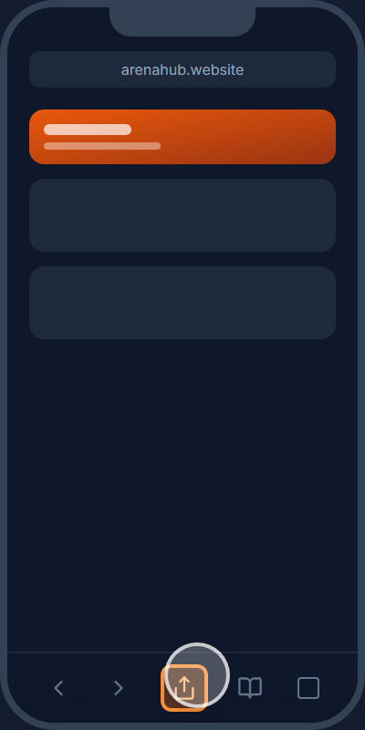

1. Abra o ArenaHub no **Safari** (não pelo Instagram nem pelo Chrome).
2. Toque no botão **Compartilhar**, na barra de baixo.
3. Role o menu e toque em **"Adicionar à Tela de Início"**.
4. Toque em **"Adicionar"** no canto superior direito.

### No Android

Abra o ArenaHub e toque em **Instalar** no aviso que aparece. Se ele não
aparecer, use os três pontinhos do Chrome → **"Instalar aplicativo"**.

### Ative as notificações

Depois de instalar, abra o app pela tela de início e toque em **Ativar** na faixa
do topo. Sem essa permissão o celular não te avisa de nada.

Você pode mandar este link direto para seus alunos: **arenahub.website/instalar**
— é a mesma explicação, numa página só.

---

## 1. O que é o ArenaHub

O ArenaHub é um sistema de **gestão para academias e escolas esportivas** — beach tennis, padel, futevôlei, crossfit, pilates, futebol, luta e qualquer outra modalidade que dá aulas e tem alunos. Ele resolve o "fim do caderninho e do grupo de WhatsApp lotado": agenda de aulas, controle de presença, cobrança de mensalidades/avulsas, comunidade, torneios e notificações — tudo em um só lugar.


O sistema é **multi-inquilino (multi-tenant)**: cada academia é uma organização isolada. Dono, professores e alunos são vinculados à academia por uma **membership** (vínculo com papel). A mesma pessoa pode ser aluno de uma academia e dono de outra — os papéis são por academia, não globais.

> **🔧 Nos bastidores**
> - Cada academia = 1 registro em `organizations`.
> - Cada vínculo pessoa↔academia = 1 registro em `memberships` com `role` = `admin` (dono/professor) ou `student` (aluno). **O papel mora na membership**, não no perfil do usuário.
> - O acesso é protegido em duas camadas: o `middleware.ts` (Edge) só checa o cookie de sessão; a validação real de usuário e papel acontece no *Server Component* de cada layout, usando o cliente admin do Supabase (service role, ignora RLS) para ler o papel de forma confiável.

---

## 2. Cadastro da academia

O cadastro começa em **`/criar-academia`**. É aqui que o **dono** cria a conta da arena.

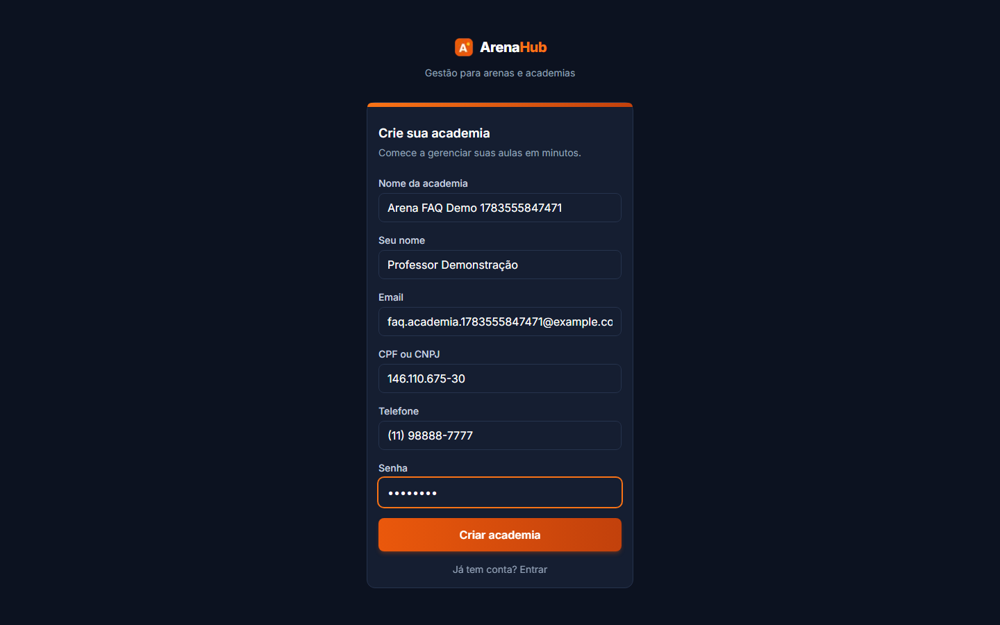

**Campos:**

| Campo | Observação |
|---|---|
| **Nome da academia** | Nome público da arena (aparece no painel e na vitrine). |
| **Seu nome** | Nome do dono/responsável. |
| **Email** | Vira o login do dono. |
| **CPF ou CNPJ** | Documento do responsável/empresa. Validado (dígito verificador) e **único** — não é possível cadastrar dois donos com o mesmo documento. |
| **Telefone** | Contato do responsável. |
| **Senha** | Mínimo de 6 caracteres. |

Ao clicar em **Criar academia**, o sistema cria tudo de uma vez e já faz o login automático, levando o dono direto para o **onboarding**.

> **🔧 Nos bastidores** (`features/organizations/actions.ts → createAcademy`)
> 1. Cria o usuário no Supabase Auth (`admin.createUser`, com `email_confirm: true` — hoje o e-mail **não** precisa ser validado para entrar).
> 2. Cria a `organizations` com `owner_id`, `owner_document` (único) e `onboarding_completed = false`.
> 3. Cria a assinatura da plataforma em `platform_subscriptions` com status `trialing` e **30 dias grátis**.
> 4. Cria/promove a `memberships` do dono para `role = 'admin'`.
> 5. O client faz `signInWithPassword` e redireciona para `/onboarding`.

---

## 3. Onboarding — endereço, esportes e marca

Logo após criar a conta, o dono cai na tela de onboarding (**`/onboarding`**). Ela define **onde** fica a arena, **quais esportes** ela oferece e a **identidade visual**.

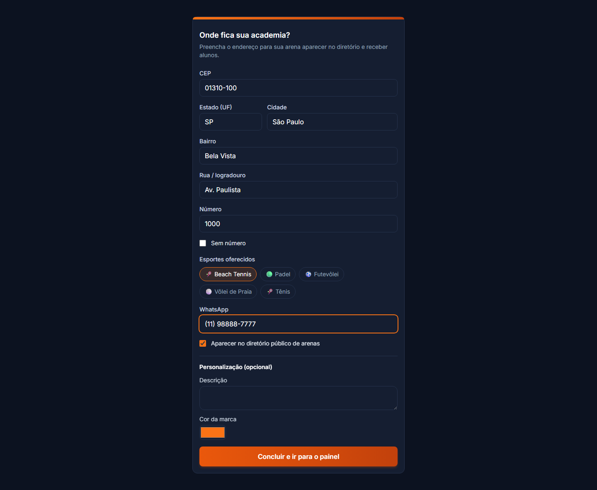

**Passo a passo:**

1. **CEP** — ao digitar, o sistema busca o endereço automaticamente (via ViaCEP) e preenche Estado, Cidade, Bairro e Rua.
2. **Número** (ou marque **Sem número**).
3. **Esportes oferecidos** — clique nas modalidades da lista (Beach Tennis, Padel, CrossFit, Pilates, Futebol e várias outras) ou use **Outro** para digitar uma modalidade que não está na lista. Isso define o que aparece na vitrine pública da academia.
4. **WhatsApp** — contato público.
5. **Aparecer no diretório público de arenas** — se marcado, a academia entra na vitrine pública para captar novos alunos.
6. **Personalização (opcional)** — descrição e **Cor da marca** (o app inteiro do aluno e o painel adotam essa cor).

Clique em **Concluir e ir para o painel**.

> **🔧 Nos bastidores** (`completeOnboarding`)
> - Grava endereço, esportes (`sports[]`), WhatsApp, flag de diretório, descrição e `brand_color` na `organizations`.
> - Marca `onboarding_completed = true`.
> - **Gate de acesso:** enquanto o onboarding não estiver concluído, o dono é sempre redirecionado de volta para `/onboarding` ao tentar abrir o painel.
> - A `brand_color` é aplicada como CSS custom properties (`accentVars`) — por isso a arena consegue "colorir" a interface sem deploy.

---

## 4. Painel administrativo (Dashboard)

Concluído o onboarding, o dono chega ao **painel admin** (`/admin/dashboard`). O menu lateral concentra todas as áreas de gestão.

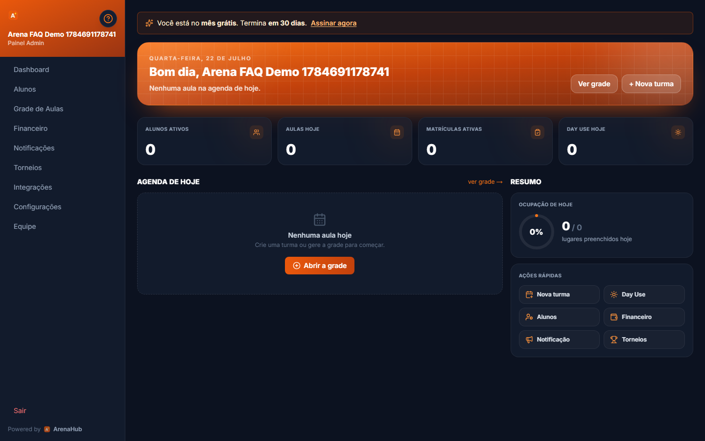

**O que a tela mostra:**

- **Faixa de abertura:** saudação, data e o pulso do dia ("5 aulas hoje · 22 alunos esperados"), com atalhos para a grade e para criar turma.
- **Cartões de resumo:** Alunos ativos, Aulas hoje, Matrículas ativas, Day use hoje.
- **Agenda de hoje:** as aulas do dia em linha do tempo, com um marcador de **agora** que corre com o relógio. Cada aula mostra a barra de ocupação (quantos dos lugares já estão preenchidos) e leva direto para a **chamada**. Aula que já passou fica apagada; a que está rolando ganha destaque.
- **Resumo:** anel com a **ocupação do dia** (lugares preenchidos sobre o total) e as turmas mais cheia e mais vazia — útil para saber onde ainda dá para encaixar aluno.
- **Ações rápidas:** Nova turma, Day Use, Alunos, Financeiro, Notificação, Torneios.
- **Banner do mês grátis** (topo): mostra quantos dias faltam do período de teste e leva para a assinatura.

O menu lateral segue esta ordem: **Dashboard · Alunos · Grade de Aulas · Financeiro · Notificações · Torneios · Integrações · Configurações · Equipe**.

> **🔧 Nos bastidores**
> - O layout `app/(admin)/layout.tsx` roda uma bateria de **gates** a cada request: sem sessão → `/login`; precisa trocar senha → `/definir-senha`; não é admin da academia ativa → `/home`; onboarding incompleto → `/onboarding`; assinatura da plataforma vencida → `/admin/assinatura`; academia suspensa → aviso de suspensão.
> - Professores veem um subconjunto do menu (o dono vê tudo). O que cada papel enxerga é decidido por `canAccessArea(area, isOwner)`.

---

## 5. Alunos — cadastrar e gerenciar

Em **Alunos** o dono vê a lista de alunos da academia e cadastra novos. Há **duas formas** de um aluno entrar na academia:

- **A) A academia cadastra o aluno** (gestão completa — descrita aqui).
- **B) O aluno se cadastra pelo link de convite** (veja a seção [Equipe](#14-equipe--convidar-alunos-e-professores) e o **Manual do Aluno**).

### 5.1 Cadastrar um aluno pela plataforma

Clique em **Criar aluno**. Um modal pede **Nome completo** e **E-mail**.

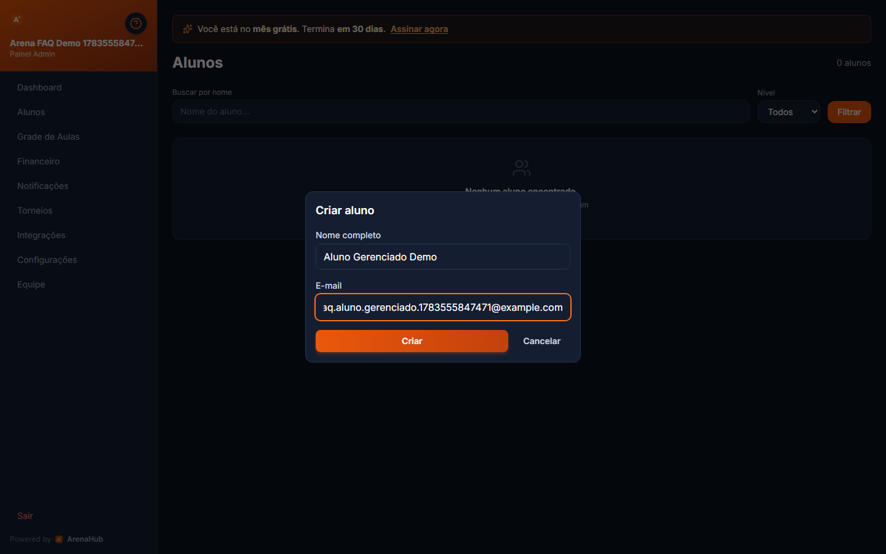

Ao confirmar, o sistema gera uma **senha temporária** e a exibe **uma única vez**. Copie e repasse ao aluno — no primeiro login ele será obrigado a trocá-la.

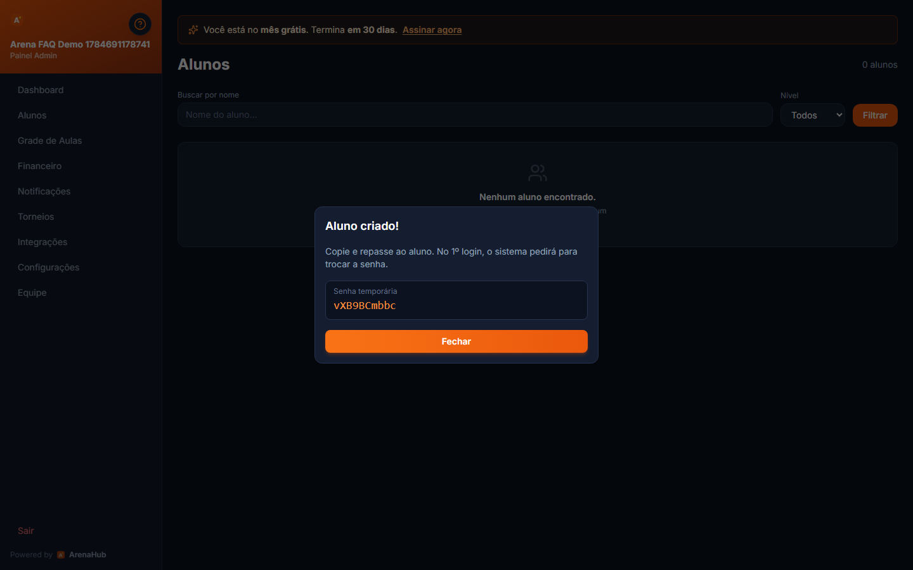

Depois disso o aluno aparece na lista, com tipo de plano:

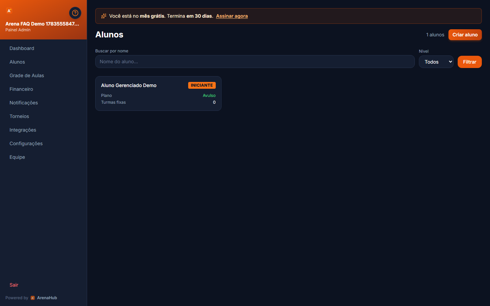

Na lista você tem busca por nome e filtro por **nível** (Iniciante, D, C, B, A) — útil para academias que usam nível como uma categoria interna do aluno. Cada cartão mostra o **plano** (Mensalista, Avulso, Wellhub, TotalPass) e a quantidade de **turmas fixas**.

> **🔧 Nos bastidores** (`createStudent`)
> - Cria o usuário no Auth com senha aleatória e `must_change_password: true` nos metadados.
> - Cria a `memberships` com `role = 'student'` vinculada à academia ativa.
> - A senha temporária é retornada **apenas na resposta da action** e mostrada no modal — não fica salva em texto puro.
> - No primeiro login, o gate `must_change_password` força o aluno a passar por `/definir-senha` antes de acessar qualquer coisa.

### 5.2 Nível do aluno

O **nível** (Iniciante, D, C, B, A) é uma categoria informativa que a academia pode usar para buscar/filtrar alunos — ele **não bloqueia** o acesso a turmas. Todo aluno vê e pode se inscrever em qualquer turma da academia, com uma única exceção: turmas do tipo **Kids** só ficam visíveis para quem tem um **dependente** cadastrado.

---

## 6. Grade de aulas e turmas

Em **Grade de Aulas** o dono/professor monta a agenda semanal recorrente e vê as sessões do dia.

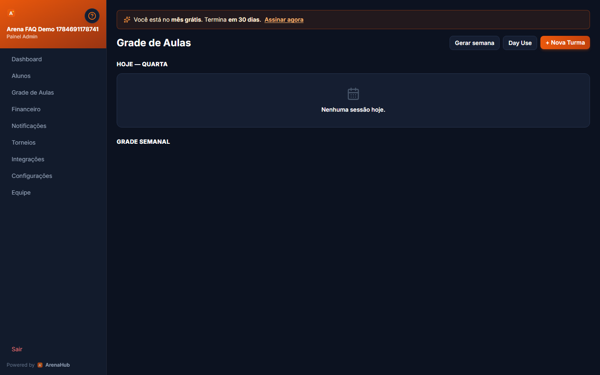

A tela tem duas partes: **HOJE** (sessões do dia) e **GRADE SEMANAL** (turmas fixas por dia da semana). No topo há os botões **Day Use** e **+ Nova Turma**.

### 6.1 Criar uma turma

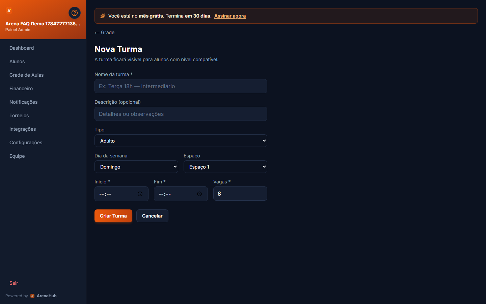

**Campos:**

| Campo | Função |
|---|---|
| **Nome da turma** | Ex.: "Terça 18h — Intermediário". |
| **Descrição** | Observações (opcional). |
| **Tipo** | Adulto / Kids etc. |
| **Dia da semana** | A turma se repete toda semana nesse dia. |
| **Espaço** | Qual espaço da academia. |
| **Início / Fim** | Horário. |
| **Vagas** | Capacidade (padrão 8). |

Ao criar, a turma fica visível para todos os alunos (exceto turmas **Kids**, visíveis só para quem tem dependente cadastrado).

> **🔧 Nos bastidores**
> - **`classes`** = o *template* recorrente da turma (dia da semana, horário, vagas).
> - **`class_sessions`** = a instância **datada** de cada aula (a "aula do dia 10/07"). É o que o aluno agenda e onde a presença é registrada.
> - **`enrollments`** = matrícula fixa semanal do aluno numa turma. **`session_bookings`** = reservas avulsas/reposição para uma sessão específica.
> - Essa separação permite ter uma grade fixa e, ao mesmo tempo, tratar exceções (falta, reposição, day use) sem bagunçar o template.

### 6.2 Day use

O botão **Day Use** abre a reserva de espaço avulsa (sem consumir crédito de aula). O professor publica horários e o aluno reserva pelo app.

---

## 6.3 Relatório de frequência

Em **Relatórios** você vê quem está vindo às aulas, por **semana** (padrão) ou por **mês**, com navegação para períodos anteriores.


**O que a tela mostra:**

- **Números do período:** aulas realizadas, presenças, faltas e o comparecimento geral da academia.
- **Por aluno:** presenças, faltas, avisos e o **aproveitamento** (presenças ÷ aulas previstas). Dá para ordenar por qualquer coluna; a ordem padrão é por aproveitamento, porque ordenar por presenças absolutas favoreceria quem simplesmente tem mais aulas na semana.
- **Aulas sem chamada:** nessas, todo mundo entrou como presente. É o ponto onde você corrige — e também o que revela uma aula que não aconteceu.

> **🔧 Nos bastidores**
> - A presença é **presumida**: quem estava previsto numa aula que já passou conta como presente até você marcar a falta na chamada. Sem isso o relatório nasceria vazio, porque a chamada quase nunca era feita.
> - Quem **avisou** que não vem (saiu da aula pelo app antes de ela começar) conta numa categoria própria, separada de quem simplesmente não apareceu. O aviso entra no total de aulas previstas, então também pesa no aproveitamento.
> - Marcar a chamada **vence** a presunção: a linha gravada é a verdade.
> - A contagem começa na data em que a frequência passou a ser rastreada. Aulas anteriores ficam de fora — nada é afirmado sobre aula que ninguém conferiu.
> - A lista da chamada passou a incluir também o **aluno fixo sem reserva gerada**. Antes ele não aparecia, e por isso a falta dele nunca era registrada.

---

## 7. Financeiro — planos, avulsa e day use

A área **Financeiro** tem três abas: **Visão geral**, **Planos e preços** e **Integrações**.

### 7.1 Visão geral

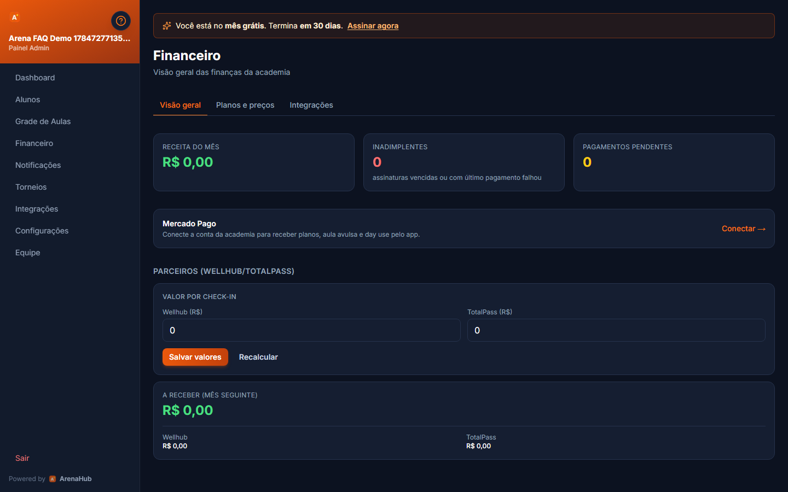

Mostra **Receita do mês**, **Inadimplentes** (assinaturas vencidas ou com último pagamento falho) e **Pagamentos pendentes**. Abaixo, o atalho para conectar o **Mercado Pago** e a seção **Parceiros (Wellhub/TotalPass)**, onde a academia define o **valor por check-in** de cada parceiro e vê o quanto tem **a receber no mês seguinte**.

### 7.2 Planos e preços

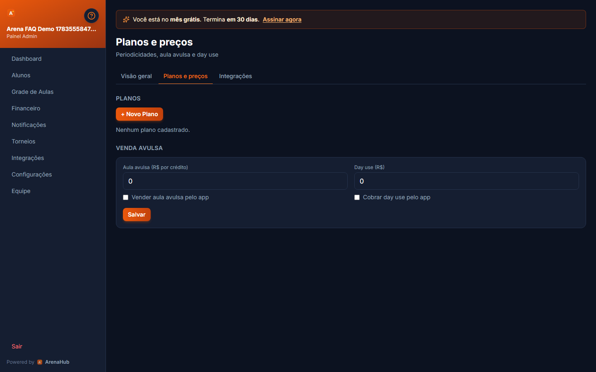

Aqui a academia cria os **planos** (mensalidades por periodicidade) e configura a **venda avulsa**:

- **Aula avulsa (R$ por crédito)** + opção **Vender aula avulsa pelo app**.
- **Day use (R$)** + opção **Cobrar day use pelo app**.

> **🔧 Nos bastidores**
> - Vender planos/avulsa/day use **pelo app** exige o **Mercado Pago conectado** (senão não há como receber). Os valores por check-in de parceiros alimentam o cálculo de "a receber" a partir dos check-ins registrados na tabela `checkins`.

### 7.3 Integrações (financeiro)

A aba **Integrações** conecta o **gateway de pagamento** — detalhado nas próximas duas seções.

---

## 8. Integração com o banco (Mercado Pago)

O ArenaHub recebe pagamentos de alunos (planos, aula avulsa, day use) **direto na conta Mercado Pago da própria academia**, via marketplace/OAuth. Ou seja: o dinheiro cai na conta da arena, não numa conta intermediária.

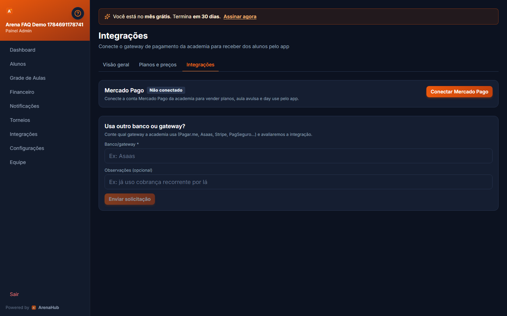

### 8.1 O que você precisa

- Uma **conta Mercado Pago** da academia (pode ser a conta de vendedor comum).
- Ser o **dono** da academia (a área financeira é *owner-only*; professores não conectam).

### 8.2 Como conectar (passo a passo)

1. Vá em **Financeiro → Integrações**.
2. No cartão **Mercado Pago**, clique em **Conectar Mercado Pago**.
3. Você é levado ao site oficial do Mercado Pago (`auth.mercadopago.com`) para **autorizar** o ArenaHub a criar cobranças em nome da sua conta.
4. Após autorizar, o Mercado Pago redireciona de volta e a conta aparece como **conectada**.

Enquanto não está conectado, o cartão exibe o status **"Não conectado"**.

> **🔧 Nos bastidores** (`features/financeiro/gatewayActions.ts`, `lib/billing/mpClient.ts`)
> - O botão chama `getMercadoPagoAuthUrl`, que monta a URL de autorização:
>   `https://auth.mercadopago.com/authorization?client_id={MP_APP_ID}&response_type=code&platform_id=mp&state={assinado}&redirect_uri={SITE}/api/integrations/mercadopago/callback`.
> - O **`state`** é assinado com o segredo da aplicação (`MP_APP_SECRET`) e carrega `orgId`/`userId` — protege contra CSRF e identifica de qual academia veio a conexão.
> - No callback, o `code` é trocado por tokens (`mpExchangeOAuthCode`) e salvo em **`org_gateway_accounts`** (`gateway = 'mercadopago'`, `status`, `mp_user_id`, `token_expires_at` + tokens). O token é renovado automaticamente (`mpRefreshOAuthToken`).
> - **Credenciais da plataforma** (definidas pela ArenaHub, não pela academia): variáveis de ambiente `MP_APP_ID` e `MP_APP_SECRET`. Se ausentes, o botão retorna "Integração indisponível no momento".
> - Cobranças usam: **preapproval** (assinaturas/mensalidades recorrentes) e **Checkout Pro** (aula avulsa e day use). Os pagamentos confirmam via **webhook** do Mercado Pago.

### 8.3 Desconectar

Ao desconectar, **novos** checkouts ficam bloqueados, mas **assinaturas já ativas** continuam sendo processadas pelo webhook (para não interromper cobranças em andamento).

---

## 9. Integração Wellhub (Gympass) / TotalPass

A integração com a **Wellhub** (ex-Gympass) permite que alunos façam **check-in** pela Wellhub e a academia receba por check-in. A conexão fica em **Integrações** (menu lateral).

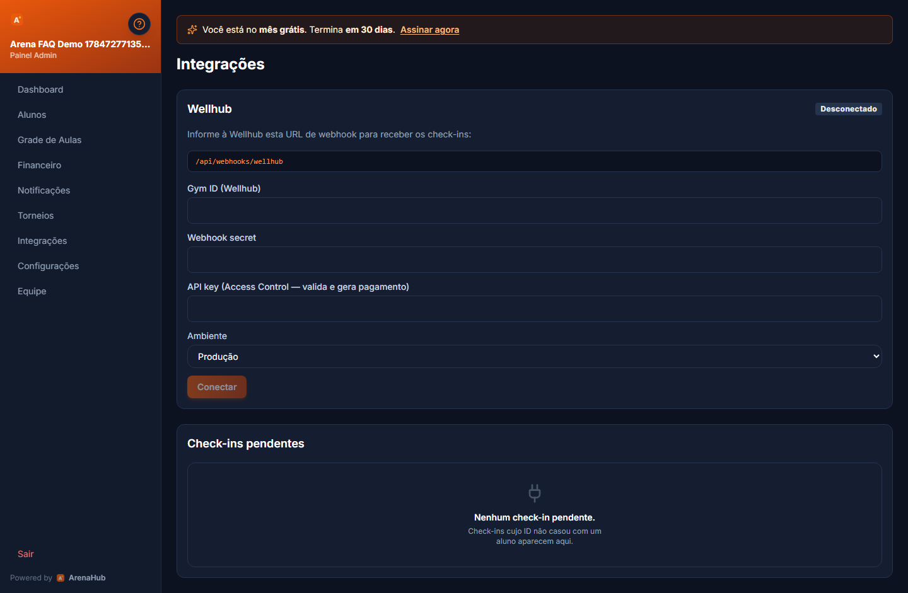

### 9.1 O que você precisa (credenciais)

Ao fechar o contrato com a Wellhub, a academia recebe as credenciais da **Access Control API**. No formulário você informa:

| Campo | O que é / onde consegue |
|---|---|
| **URL de webhook** | Gerada pelo ArenaHub: `/api/webhooks/wellhub`. **Copie e cadastre na Wellhub** — é para lá que a Wellhub envia os check-ins. |
| **Gym ID (Wellhub)** | Identificador da sua unidade na Wellhub. |
| **Webhook secret** | Segredo compartilhado usado para **validar a assinatura** dos webhooks. |
| **API key (Access Control)** | Chave que **valida** o acesso do aluno na hora do check-in e **gera o pagamento** para a academia. |
| **Ambiente** | **Produção** ou **Sandbox** (para testes). |

Clique em **Conectar**. O status muda de **"Desconectado"** para conectado.

### 9.2 Como funciona o check-in

1. O aluno faz check-in pelo app da Wellhub na sua arena.
2. A Wellhub dispara um webhook para `/api/webhooks/wellhub`.
3. O ArenaHub identifica a academia pelo **Gym ID**, valida a **assinatura** do webhook e registra o check-in.
4. Se a academia informou a **API key**, o sistema também chama o endpoint **validate** da Wellhub para confirmar o acesso e gerar o pagamento.

### 9.3 Check-ins pendentes

Quando um check-in chega mas o sistema **não consegue casar** o ID Wellhub com um aluno cadastrado, ele aparece na seção **Check-ins pendentes**, e o dono pode **vincular manualmente** o check-in ao aluno correto.

Cada pendência mostra o **nome de quem fez o check-in** (a Wellhub envia nome e sobrenome junto do evento), além do ID, da data e do selo **Validado**. Use o nome para escolher o aluno na lista e clicar em **Vincular**. Se a Wellhub não mandar o nome no evento, aparece *"Nome não informado pelo parceiro"* — nesse caso, o ID é a única pista.

Ao vincular, o ID do parceiro é gravado no aluno — os próximos check-ins dele passam a casar sozinhos.

> **⚠️ IDs com espaço**
> O portal da Wellhub exibe o ID agrupado (`3603 3181 0803 2`), mas o check-in chega sem espaços (`3603318108032`). O sistema **remove os espaços automaticamente** ao salvar, então pode colar o ID direto do portal.

> **🔧 Nos bastidores** (`app/api/webhooks/wellhub/route.ts`, `lib/checkin/*`, `features/checkin/actions.ts`)
> - O webhook roda em runtime Node.js e recebe o header `x-gympass-signature`.
> - `parseWellhubEvent` lê eventos cujo tipo começa com `checkin`, extrai `gym.id`, o `unique_token` (gympass_id de 13 dígitos) e o timestamp (epoch → data local BRT).
> - `wellhubMemberName` lê `event_data.user.first_name`/`last_name` do **payload cru** guardado em `pending_checkins.payload` — por isso o nome aparece até nas pendências antigas, sem coluna nova.
> - `normalizePartnerId` (`lib/checkin/partnerId.ts`) remove **todo** espaço em branco do ID — inclusive os **internos** do copy/paste do portal, que o `.trim()` não pegava e que faziam todo check-in do aluno cair em pendentes.
> - `verifyWellhubSignature` recalcula um **HMAC-SHA1** (hex maiúsculo) com o `webhook_secret` e compara com `timingSafeEqual` (à prova de timing attack).
> - `connectIntegration('wellhub', …)` faz *upsert* em **`org_integrations`** (chave `organization_id, partner`) com `gym_id`, `webhook_secret`, `api_key`, `environment`, `status`.
> - `wellhubValidate` chama `POST {base}/access/v1/validate` com header `X-Gym-Id` + `Bearer api_key`. Base **sandbox** = `apitesting.partners.gympass.com`; **produção** = `api.partners.gympass.com`. Sucesso = `metadata.errors == 0`.
> - Check-ins vão para **`checkins`**; os não-casados para **`pending_checkins`**, resolvidos por `resolvePendingCheckin`.
> - O aluno associa seu próprio ID de parceiro no perfil (`selfSetPartnerId`), gravado em `memberships.wellhub_id` / `totalpass_id`.

### 9.4 TotalPass

O **TotalPass** funciona de forma análoga (check-in via parceiro). O valor por check-in do TotalPass é configurado na mesma seção **Parceiros** do Financeiro.

---

## 10. Outros gateways de pagamento

Se a academia usa outro banco/gateway (Pagar.me, Asaas, Stripe, PagSeguro…), há um formulário **"Usa outro banco ou gateway?"** na aba Financeiro → Integrações, para **solicitar** a avaliação da integração.

Preencha **Banco/gateway** e **Observações** e clique em **Enviar solicitação**.

> **🔧 Nos bastidores** (`requestGatewayIntegration`)
> - Grava a solicitação em **`gateway_integration_requests`** (`organization_id`, `requested_by`, `gateway_name`, `notes`). É uma fila de pedidos que a equipe ArenaHub avalia — não conecta automaticamente.

---

## 11. Notificações

Em **Notificações** a academia envia comunicados segmentados para os alunos.

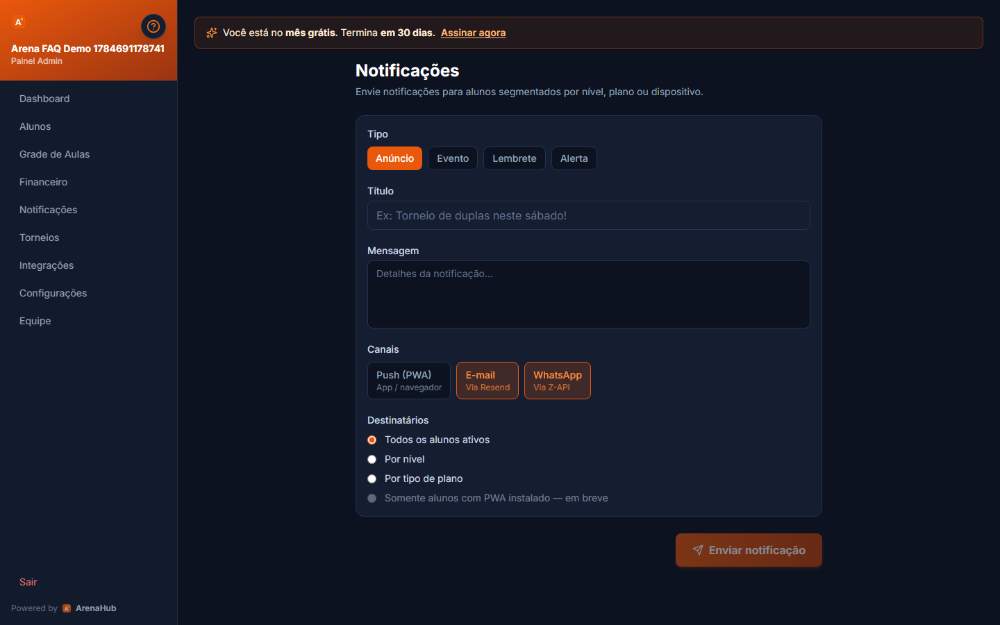

**Como enviar:**

1. **Tipo:** Anúncio, Evento, Lembrete ou Alerta.
2. **Título** e **Mensagem**.
3. **Canais:** Push (PWA — notificação no dispositivo), E-mail (via Resend), WhatsApp (via gateway).
4. **Destinatários:** Todos os alunos ativos, Por nível, Por tipo de plano, ou Somente alunos com PWA instalado.
5. **Enviar notificação**.

> **🔧 Nos bastidores**
> - Push depende do aluno ter instalado o **PWA** e concedido permissão (assinatura Web Push).
> - E-mail sai pelo provedor **Resend**; WhatsApp depende do gateway configurado.

---

## 12. Torneios

Em **Torneios** a academia cria e divulga torneios (com inscrição paga opcional).

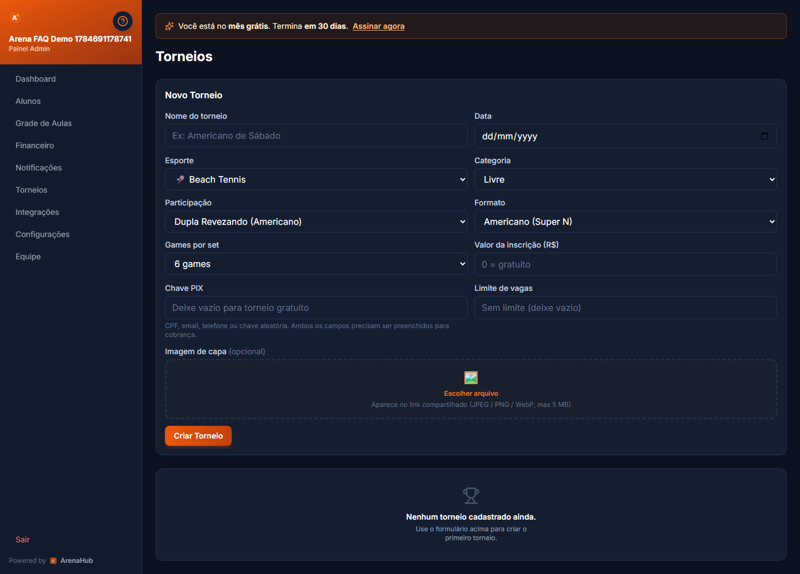

**Campos do novo torneio:** Nome, Data, Esporte, Categoria, Participação (ex.: Dupla Revezando/Americano), Formato (ex.: Americano Super N), Games por set, **Valor da inscrição** (0 = gratuito), **Chave PIX** (para cobrança — CPF, e-mail, telefone ou chave aleatória), Limite de vagas e Imagem de capa.

> **Cobrança:** para inscrição paga, **valor e chave PIX precisam estar preenchidos**. O torneio gera um link compartilhável com a imagem de capa.

---

## 13. Configurações

Em **Configurações** ficam os parâmetros globais da academia.

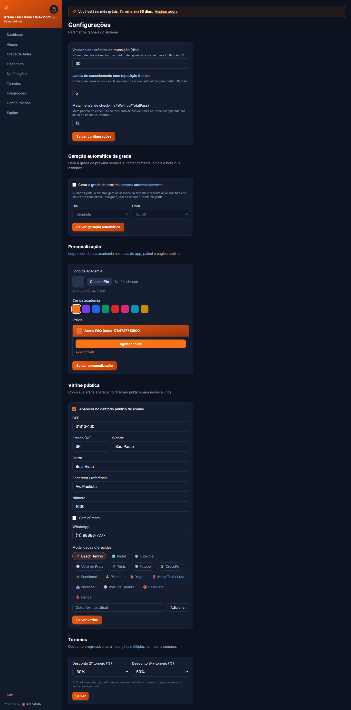

Principais blocos:

- **Regras de crédito/reposição:** validade dos créditos de reposição (dias), janela de cancelamento com reposição (horas — padrão 5h), meta mensal de check-ins de parceiro.
- **Personalização:** logo da academia, cor da marca e **prévia** (com botão de **Agendar aula** para simular a marca).
- **Vitrine pública:** dados que aparecem no diretório público (CEP, endereço, WhatsApp, esportes oferecidos, flag "aparecer no diretório").
- **Torneios:** descontos progressivos para inscrições múltiplas na mesma semana (2º e 3º torneio).

> **🔧 Nos bastidores**
> - A janela de cancelamento (padrão **5h**) alimenta `canCancelWithRefund()` em `lib/utils/creditRules.ts`: cancelou dentro da janela → recebe crédito de reposição; fora dela → perde o crédito.
> - A validade do crédito de reposição alimenta `getMakeupCreditExpiry()`.

---

## 14. Equipe — convidar alunos e professores

Em **Equipe** a academia convida alunos em massa (via link/QR) e adiciona professores.

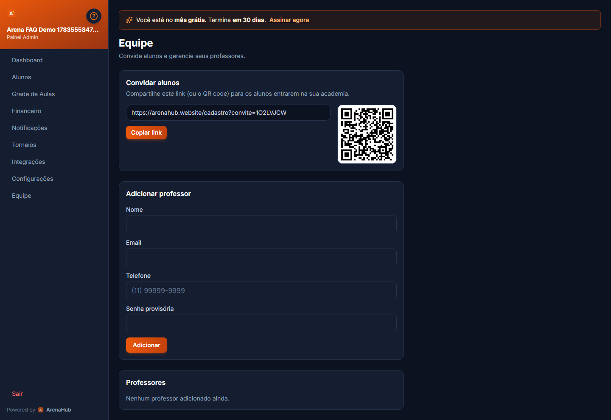

### 14.1 Convidar alunos

Compartilhe o **link de convite** (ou o **QR code**) para os alunos se cadastrarem sozinhos:

```
https://arenahub.website/cadastro?convite=SEU_CODIGO
```

Clique em **Copiar link** ou mostre o QR. Todo aluno que entrar por esse link já cai vinculado à sua academia. *(O fluxo do lado do aluno está no **Manual do Aluno**.)*

### 14.2 Adicionar professor

No bloco **Adicionar professor**, informe **Nome, Email, Telefone** e uma **Senha provisória**. O professor entra com acesso ao painel (com menos áreas que o dono).

> **🔧 Nos bastidores**
> - O `invite_code` é um código curto salvo na `organizations`. O aluno que se cadastra com `?convite=CODE` tem esse código lido pelos metadados do signup e é vinculado à academia (`resolveInviteCode` / `joinAcademy`).
> - O professor é criado por `createProfessor` com `role = 'admin'` na membership, mas o menu é filtrado por `canAccessArea` — por isso ele vê menos itens que o dono (`isOwner`).

---

## 15. Assinatura da plataforma

A academia usa o ArenaHub via **assinatura mensal**. O **primeiro mês é grátis** (30 dias de trial). Um banner no topo do painel lembra quantos dias faltam; ao fim do período, é preciso assinar para manter o painel ativo.

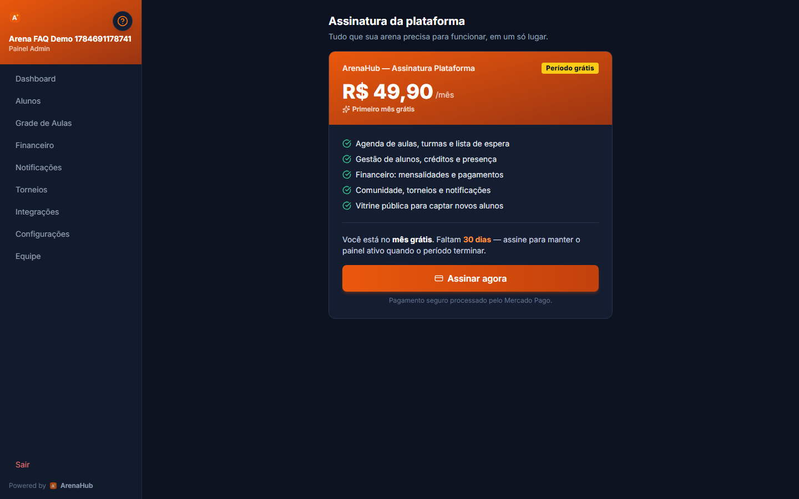

- **Valor:** R$ 49,90/mês (primeiro mês grátis).
- **Inclui:** agenda de aulas/turmas/lista de espera, gestão de alunos/créditos/presença, financeiro, comunidade/torneios/notificações e vitrine pública.
- **Pagamento** processado com segurança pelo Mercado Pago.

> **🔧 Nos bastidores**
> - O status vive em **`platform_subscriptions`** (`trialing` → `active`/`past_due`). O gate `getPlatformAccess` no layout admin bloqueia o painel (exceto a própria página de assinatura) quando o acesso não está em dia.
> - **Atenção:** essa é a cobrança **academia → plataforma**, diferente da cobrança **aluno → academia** (Mercado Pago da academia, seção 8).

---

## Resumo do fluxo (do zero ao dia a dia)

1. **Criar academia** (`/criar-academia`) → login automático.
2. **Onboarding** (endereço + esportes + marca) → painel.
3. **Configurar planos/preços** e **conectar Mercado Pago** (para receber dos alunos).
4. *(Opcional)* **Conectar Wellhub/TotalPass** para check-ins de parceiro.
5. **Montar a grade** (turmas) e **cadastrar/convidar alunos**.
6. **Operar:** presença, notificações, torneios, financeiro.
7. **Assinar a plataforma** antes do fim do mês grátis.

> **Manual complementar:** o uso pelo aluno está em [`aluno.md`](aluno.md).
