# Manual do Aluno — ArenaHub

> Guia completo para o **aluno** que vai usar o ArenaHub no dia a dia.
> Cobre do zero: **cadastro pelo link da academia (ou senha temporária) → primeiro acesso → agendar aulas, day use, financeiro, comunidade, torneios e perfil.**
>
> Cada seção traz o passo a passo, a tela real do app e um bloco **🔧 Nos bastidores** explicando o que o sistema faz por baixo dos panos.

**Produção:** <https://www.arenahub.website>
**Onde usar:** o app do aluno é feito para o **celular** (PWA instalável). A navegação fica na **barra inferior**: Home · Aulas · (+) · Comunidade · Perfil.

> 💡 Este manual também fica disponível **dentro do app**: toque no botão de ajuda **(?)** → **Documentação**.

---

## Índice

1. [Como entrar na academia](#1-como-entrar-na-academia)
   - [A) Cadastro pelo link de convite](#a-cadastro-pelo-link-de-convite)
   - [B) Aluno cadastrado pela academia (senha temporária)](#b-aluno-cadastrado-pela-academia-senha-temporária)
2. [Home — sua tela inicial](#2-home--sua-tela-inicial)
3. [Agendar aula](#3-agendar-aula)
4. [Day use](#4-day-use)
5. [Minhas aulas](#5-minhas-aulas)
6. [Financeiro — plano e pagamentos](#6-financeiro--plano-e-pagamentos)
7. [Comunidade](#7-comunidade)
8. [Torneios](#8-torneios)
9. [Perfil — dados, créditos e ficha](#9-perfil--dados-créditos-e-ficha)

---

## 1. Como entrar na academia

Há **duas formas** de você virar aluno de uma academia no ArenaHub.

### A) Cadastro pelo link de convite

A academia compartilha um **link** (ou um **QR code**) parecido com:

```
https://arenahub.website/cadastro?convite=CODIGO
```

Ao abrir o link, o app mostra que você foi convidado e pergunta se **já tem conta**:

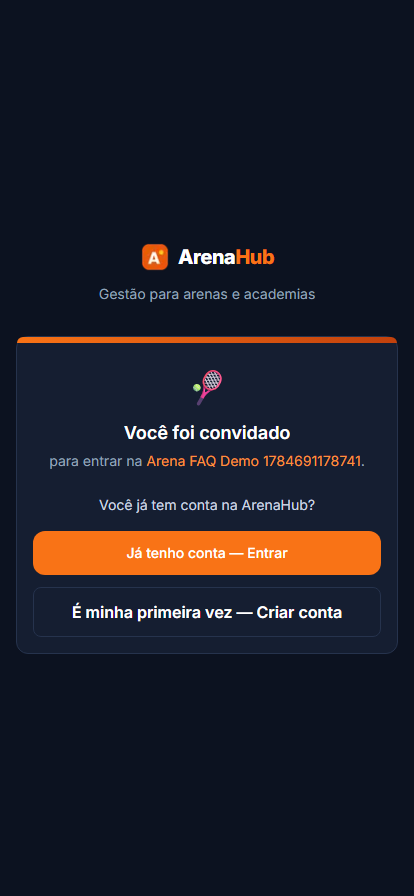

- **Já tenho conta — Entrar:** use se você já é aluno de outra academia (você passa a fazer parte das duas).
- **É minha primeira vez — Criar conta:** para criar sua conta do zero.

Escolhendo criar conta, preencha o formulário:

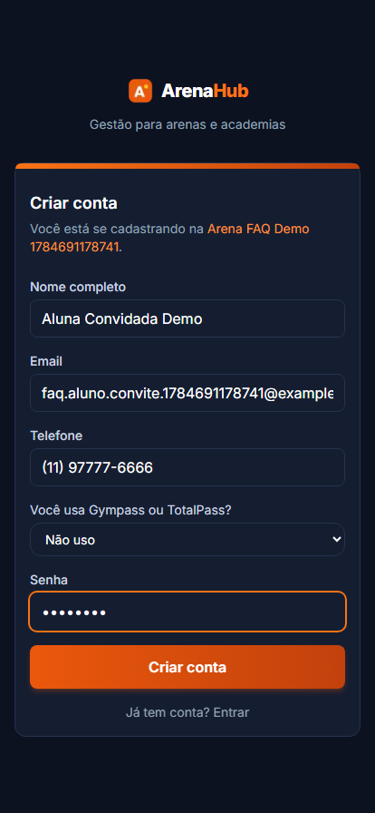

**Campos:**

| Campo | Observação |
|---|---|
| **Nome completo** | Seu nome. |
| **Email** | Vira seu login. |
| **Telefone** | Contato. |
| **Você usa Gympass ou TotalPass?** | Se usar, selecione o parceiro e informe seu **ID de parceiro** (pode fazer isso depois, no Perfil). |
| **Senha** | Sua senha de acesso. |

Clique em **Criar conta** — você entra direto na **Home**.

> **🔧 Nos bastidores**
> - O cadastro usa `supabase.auth.signUp` com metadados `{ full_name, org_invite_code, pending_partner, partner_id }`.
> - O `org_invite_code` (o `CODIGO` do link) vincula você à academia certa, criando uma `memberships` com `role = 'student'`.
> - Se você já tinha conta, o convite apenas cria **mais uma membership** — a mesma conta pode pertencer a várias academias.

### B) Aluno cadastrado pela academia (senha temporária)

Se a academia te cadastrou pelo painel dela, você recebe um **e-mail** e uma **senha temporária**. No **primeiro login**, o sistema **obriga** a definir uma senha nova:

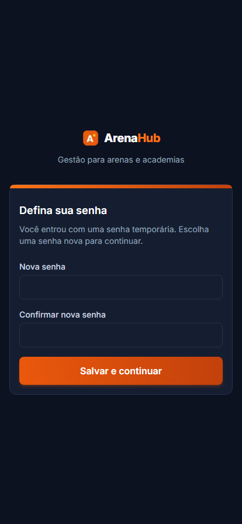

Digite **Nova senha**, confirme e clique em **Salvar e continuar**. Pronto — daqui em diante você usa a sua senha.

> **🔧 Nos bastidores**
> - A conta foi criada com `must_change_password: true`. Enquanto essa flag existir, todo acesso é redirecionado para `/definir-senha` — só depois de trocar a senha você chega ao app.

---

## 2. Home — sua tela inicial

A **Home** é o seu resumo: saudação, créditos, aulas por semana e próximas aulas.

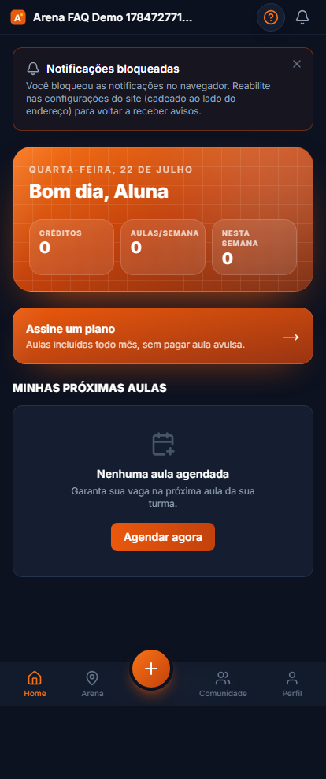

**O que aparece:**

- **Cabeçalho colorido** (na cor da marca da academia) com **Créditos** e **Aulas/semana**.
- **Assine um plano** — atalho para contratar mensalidade e ter aulas incluídas todo mês.
- **Minhas próximas aulas** — se não houver, aparece **Agendar agora**.
- **Barra inferior:** Home · Aulas · **(+)** · Comunidade · Perfil. O botão **(+)** central é o atalho para agendar.

> **🔧 Nos bastidores**
> - **Créditos** vêm de `profiles.credits_balance`, que é um valor **em cache** — a fonte da verdade é a tabela `credit_transactions` (cada aula agendada, cancelamento ou reposição é um lançamento).

---

## 3. Agendar aula

Toque em **(+)** ou em **Agendar** para ver as turmas disponíveis.

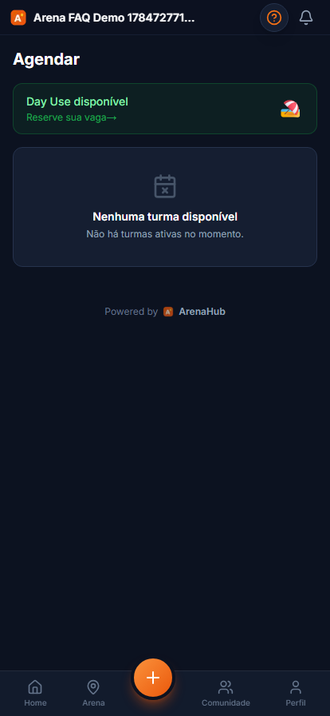

- Se houver **Day Use disponível**, um cartão verde no topo leva para a reserva de espaço.
- Abaixo aparecem as **turmas disponíveis** para você. Turmas **Kids** só aparecem se você tiver um dependente cadastrado. Se não houver nenhuma, o app avisa "Nenhuma turma disponível".

Para agendar, escolha a turma/horário e confirme. O agendamento **consome um crédito** (ou está incluso no seu plano).

> **🔧 Nos bastidores**
> - Turmas do tipo **Kids** só aparecem para quem tem ao menos um dependente vinculado (`is_dependent`); as demais turmas ficam visíveis para todos os alunos.
> - Agendar cria um `session_booking` para aquela `class_session` datada e lança o débito de crédito em `credit_transactions`.
> - **Cancelamento:** se cancelar dentro da janela definida pela academia (padrão **5h** antes), você recebe um **crédito de reposição**; fora da janela, o crédito é perdido (`canCancelWithRefund`).

---

## 4. Day use

O **Day Use** é a reserva de espaço **sem usar créditos** de aula.

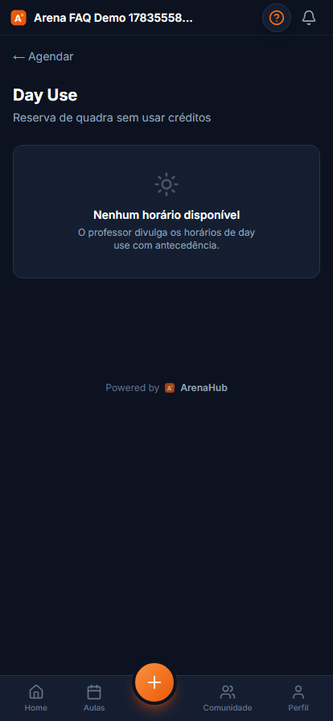

O professor **publica horários** de day use com antecedência. Quando houver horários abertos, eles aparecem aqui para você reservar. Se estiver vazio, é porque a academia ainda não divulgou horários.

> **🔧 Nos bastidores**
> - Day use é uma reserva de espaço independente da grade de turmas — não desconta crédito. Se a academia cobra day use pelo app, o pagamento passa pelo Mercado Pago da academia.

---

## 5. Minhas aulas

Na aba **Aulas** você acompanha suas aulas agendadas e o histórico.

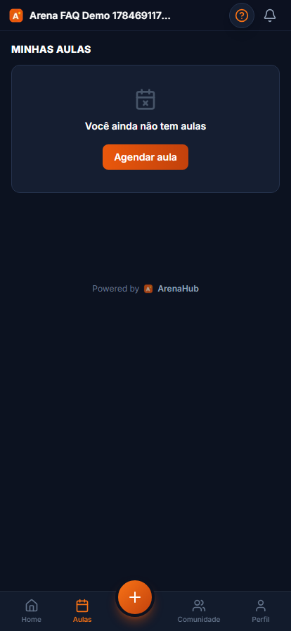

Se você ainda não agendou nada, aparece **Você ainda não tem aulas** com o botão **Agendar aula**.

---

## 6. Financeiro — plano e pagamentos

Na tela **Financeiro** você vê seu plano atual, os planos disponíveis para contratar e o histórico de pagamentos.

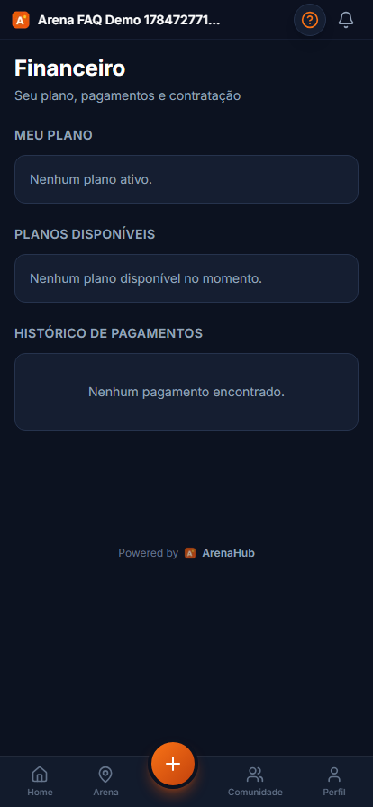

**Blocos:**

- **Meu plano** — seu plano ativo (ou "Nenhum plano ativo").
- **Planos disponíveis** — mensalidades oferecidas pela academia; toque para contratar.
- **Histórico de pagamentos** — suas cobranças e status.

> **🔧 Nos bastidores**
> - A contratação/renovação é cobrada pelo **Mercado Pago da academia**. Para haver planos disponíveis aqui, a academia precisa ter **conectado o Mercado Pago** e **cadastrado planos**.
> - Alunos de parceiro (**Wellhub/TotalPass**) normalmente não pagam mensalidade aqui — o acesso é liberado por **check-in** via webhook do parceiro.

---

## 7. Comunidade

A aba **Comunidade** é o feed social da sua academia.

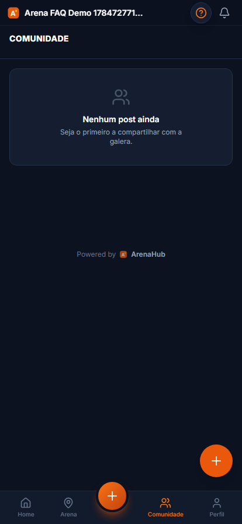

Poste novidades, fotos e recados para a turma. Se ninguém postou ainda, você pode ser o primeiro (**Seja o primeiro a compartilhar com a galera**). Use o **(+)** para criar um post.

---

## 8. Torneios

Na aba **Torneios** você vê os torneios da academia e pode se inscrever.

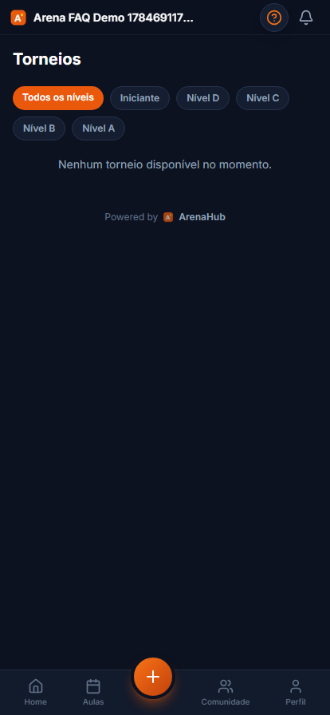

Use os filtros de **nível** (Todos os níveis, Iniciante, D, C, B, A) para achar torneios da sua categoria. Quando houver torneios abertos, eles aparecem aqui com data e valor de inscrição.

> **🔧 Nos bastidores**
> - Torneios pagos são cobrados por **PIX** (chave configurada pela academia). A academia pode oferecer **descontos progressivos** para quem se inscreve em vários torneios na mesma semana.

---

## 9. Perfil — dados, créditos e ficha

A aba **Perfil** concentra seus dados pessoais, segurança, créditos, acesso de parceiro, dependentes, gênero e ficha médica.

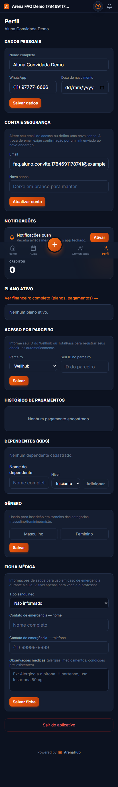

**Blocos:**

- **Dados pessoais** — nome, WhatsApp, data de nascimento.
- **Conta e segurança** — trocar e-mail (exige confirmação por link) e definir nova senha.
- **Créditos** — seu saldo atual.
- **Acesso por parceiro** — informe seu **ID Wellhub/TotalPass** para que seus check-ins sejam reconhecidos automaticamente.
- **Histórico de pagamentos**.
- **Dependentes (Kids)** — cadastre filhos/dependentes vinculados a você (você paga por eles).
- **Gênero** — usado para inscrição em torneios (categorias masculino/feminino/misto).
- **Ficha médica** — tipo sanguíneo, contato de emergência e observações (alergias, medicamentos). Visível só para você e o professor, para uso em emergências.
- **Sair do aplicativo**.

> **🔧 Nos bastidores**
> - O **ID de parceiro** é gravado na sua membership (`wellhub_id` / `totalpass_id`) via `selfSetPartnerId`. Sem ele, um check-in da Wellhub pode cair na fila de **"check-ins pendentes"** da academia, que então vincula manualmente ao seu cadastro.
> - **Dependentes** são perfis com `is_dependent: true` ligados ao seu `parent_id` — os agendamentos e pagamentos deles passam por você.
> - A **troca de e-mail** dispara um link de confirmação; a conta só muda depois que você confirma pelo link.

---

## Resumo do fluxo do aluno

1. **Entrar na academia** — pelo link de convite **ou** com a senha temporária (troca obrigatória no 1º acesso).
2. **Home** — ver créditos e próximas aulas.
3. **Agendar** aulas disponíveis (ou reservar **day use**).
4. **Financeiro** — contratar plano / ver pagamentos.
5. **Perfil** — completar dados, ID de parceiro, gênero e ficha médica.
6. Participar da **Comunidade** e dos **Torneios**.

> **Instale o app:** adicione o ArenaHub à tela inicial (PWA) para receber notificações push e abrir mais rápido.
>
> **Manual complementar:** a operação da academia está em [`academia.md`](academia.md).
