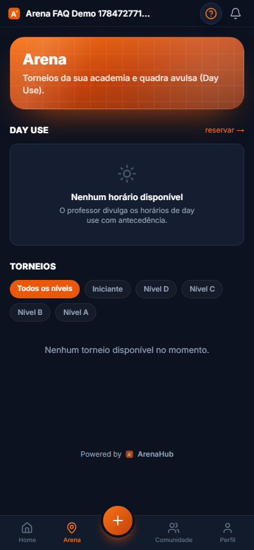

# Manual do Aluno | ArenaHub

> Guia completo para o **aluno** que vai usar o ArenaHub no dia a dia.
> Cobre do zero: **cadastro pelo link da academia (ou senha temporária) → primeiro acesso → agendar aulas, day use, financeiro, Liga (ranking) com os vídeos das quadras, torneios e perfil.**
>
> Cada seção traz o passo a passo, a tela real do app e um bloco **🔧 Nos bastidores** explicando o que o sistema faz por baixo dos panos.

**Produção:** <https://www.arenahub.website>
**Onde usar:** o app do aluno é feito para o **celular** (PWA instalável). A navegação fica na **barra inferior**: Home · Arena · (+) · Liga · Perfil.

> 💡 Este manual também fica disponível **dentro do app**: toque no botão de ajuda **(?)** → **Documentação**.

---

## Índice

- [Instale o app no seu celular](#instale-o-app-no-seu-celular)

1. [Como entrar na academia](#1-como-entrar-na-academia)
   - [A) Cadastro pelo link de convite](#a-cadastro-pelo-link-de-convite)
   - [B) Aluno cadastrado pela academia (senha temporária)](#b-aluno-cadastrado-pela-academia-senha-temporária)
2. [Home: sua tela inicial](#2-home-sua-tela-inicial)
3. [Agendar aula](#3-agendar-aula)
4. [Day use](#4-day-use)
5. [Arena: torneios e Day Use](#5-arena-torneios-e-day-use)
6. [Financeiro: plano e pagamentos](#6-financeiro-plano-e-pagamentos)
7. [Liga](#7-liga)
8. [Torneios: inscrição](#8-torneios-inscrição)
9. [Perfil: dados, créditos e ficha](#9-perfil-dados-créditos-e-ficha)

---

## Instale o app no seu celular

O ArenaHub funciona melhor instalado: abre direto da tela de início, sem digitar
endereço, e é a única forma de receber os avisos de aula cancelada, vaga liberada
na fila e lembrete de treino.

### No iPhone

O iPhone não tem botão de instalar. O caminho é pelo Safari:


1. Abra o ArenaHub no **Safari**. Pelo Instagram, pelo Facebook ou pelo Chrome
   não funciona, o menu deles não tem a opção.
2. Toque no botão **Compartilhar** (o quadradinho com a seta pra cima, na barra
   de baixo).
3. Role o menu e toque em **"Adicionar à Tela de Início"**.
4. Toque em **"Adicionar"** no canto superior direito.

### No Android

Bem mais rápido: abra o ArenaHub e toque em **Instalar** no aviso que aparece.
Se o aviso não aparecer, toque nos três pontinhos do Chrome e escolha
**"Instalar aplicativo"**.

### Depois de instalar: ative as notificações

Abra o app pela tela de início e toque em **Ativar** na faixa laranja do topo. O
celular vai perguntar se você permite notificações. Responda **Permitir**.

Se você tocou em "Bloquear" sem querer, dá pra reverter: toque no cadeado 🔒 ao
lado do endereço no navegador e libere as notificações do site.

---

## 1. Como entrar na academia

Há **duas formas** de você virar aluno de uma academia no ArenaHub.

### A) Cadastro pelo link de convite

A academia compartilha um **link** (ou um **QR code**) parecido com:

```
https://arenahub.website/cadastro?convite=CODIGO
```

Ao abrir o link, o app mostra que você foi convidado e pergunta se **já tem conta**:


- **Já tenho conta · Entrar:** use se você já é aluno de outra academia (você passa a fazer parte das duas).
- **É minha primeira vez · Criar conta:** para criar sua conta do zero.

Escolhendo criar conta, preencha o formulário:


**Campos:**

| Campo | Observação |
|---|---|
| **Nome completo** | Seu nome. |
| **Email** | Vira seu login. |
| **Telefone** | Contato. |
| **Você usa Gympass ou TotalPass?** | Se usar, selecione o parceiro e informe seu **ID de parceiro** (pode fazer isso depois, no Perfil). |
| **Senha** | Sua senha de acesso. |

Clique em **Criar conta** e você entra direto na **Home**.

> **🔧 Nos bastidores**
> - O cadastro usa `supabase.auth.signUp` com metadados `{ full_name, org_invite_code, pending_partner, partner_id }`.
> - O `org_invite_code` (o `CODIGO` do link) vincula você à academia certa, criando uma `memberships` com `role = 'student'`.
> - Se você já tinha conta, o convite apenas cria **mais uma membership**: a mesma conta pode pertencer a várias academias.

### B) Aluno cadastrado pela academia (senha temporária)

Se a academia te cadastrou pelo painel dela, você recebe um **e-mail** e uma **senha temporária**. No **primeiro login**, o sistema **obriga** a definir uma senha nova:


Digite **Nova senha**, confirme e clique em **Salvar e continuar**. Pronto, daqui em diante você usa a sua senha.

> **🔧 Nos bastidores**
> - A conta foi criada com `must_change_password: true`. Enquanto essa flag existir, todo acesso é redirecionado para `/definir-senha`: só depois de trocar a senha você chega ao app.

---

## 2. Home: sua tela inicial

A **Home** é o seu resumo: quanto falta para a próxima aula, sua agenda da semana e seus números.


**O que aparece:**

- **Cabeçalho colorido** (na cor da marca da academia) com a saudação do momento do dia, a data e três números: **Créditos** (ou seu plano parceiro), **Aulas/semana** e quantas aulas você tem **nesta semana**.
- **Próxima aula**: cartão de destaque com **contagem regressiva ao vivo** ("Faltam 2h 24min"), horário, quantos lugares já estão ocupados e o atalho para entrar na aula. Se você ainda não tem aula marcada, ele mostra a próxima com vaga aberta.
- **Sua semana**: faixa com os próximos 7 dias. Toque em um dia para ver as aulas dele: horário, quantos alunos já confirmaram e se a turma é sua. **Toque numa aula** (botão **Ver / Entrar**) para abrir a **ficha da aula**: ali você vê quem já está confirmado e **entra ou sai** da aula sem sair da Home.
- **Assine um plano**: atalho para contratar mensalidade e ter aulas incluídas todo mês.
- **Sua frequência**: presenças, faltas e aproveitamento do mês. O detalhe por mês e por ano fica no **Perfil**.
- **Minhas próximas aulas**: se não houver, aparece **Agendar agora**.
- **Barra inferior:** Home · Arena · **(+)** · Liga · Perfil. O botão **(+)** central é o atalho para agendar.

> **🔧 Nos bastidores**
> - **Créditos** vêm de `profiles.credits_balance`, que é um valor **em cache**: a fonte da verdade é a tabela `credit_transactions` (cada aula agendada, cancelamento ou reposição é um lançamento).
> - A contagem regressiva e a escolha de qual aula vai no destaque acontecem **no seu aparelho**, pelo relógio dele. O servidor roda em UTC e mostraria a aula errada perto da virada do dia.

---

## 3. Agendar aula

Toque em **(+)** ou em **Agendar** para ver as turmas disponíveis.


- Se houver **Day Use disponível**, um cartão verde no topo leva para a reserva de espaço.
- Abaixo aparecem as **turmas disponíveis** para você. Turmas **Kids** só aparecem se você tiver um dependente cadastrado. Se não houver nenhuma, o app avisa "Nenhuma turma disponível".

Para agendar, escolha a turma/horário e confirme. O agendamento **consome um crédito** (ou está incluso no seu plano).

> **🔧 Nos bastidores**
> - Turmas do tipo **Kids** só aparecem para quem tem ao menos um dependente vinculado (`is_dependent`); as demais turmas ficam visíveis para todos os alunos.
> - Agendar cria um `session_booking` para aquela `class_session` datada e lança o débito de crédito em `credit_transactions`.
> - **Cancelamento:** se cancelar dentro da janela definida pela academia (padrão **5h** antes), você recebe um **crédito de reposição**; fora da janela, o crédito é perdido (`canCancelWithRefund`).

---

## 4. Day use

O **Day Use** é a reserva de espaço **sem usar créditos** de aula.


O professor **publica horários** de day use com antecedência. Quando houver horários abertos, eles aparecem aqui para você reservar. Se estiver vazio, é porque a academia ainda não divulgou horários.

> **🔧 Nos bastidores**
> - Day use é uma reserva de espaço independente da grade de turmas e não desconta crédito. Se a academia cobra day use pelo app, o pagamento passa pelo Mercado Pago da academia.

---

## 5. Arena: torneios e Day Use

A aba **Arena** (barra inferior) reúne os **Torneios** da academia e o **Day Use** (aluguel de quadra avulsa). Suas **aulas** ficam na **Home** (agenda da semana, veja a seção [Home](#2-home-sua-tela-inicial)).



- **Day Use**: próximos horários de quadra avulsa; toque para reservar (detalhe na seção [Day use](#4-day-use)).
- **Meus torneios**: os torneios em que você já está inscrito, com o próximo confronto quando houver.
- **Torneios**: todos os torneios abertos da academia, com filtro por **nível** (detalhe na seção [Torneios](#8-torneios-inscrição)).

---

## 6. Financeiro: plano e pagamentos

Na tela **Financeiro** você vê seu plano atual, os planos disponíveis para contratar e o histórico de pagamentos.


**Blocos:**

- **Meu plano**: seu plano ativo (ou "Nenhum plano ativo").
- **Planos disponíveis**: mensalidades oferecidas pela academia; toque para contratar.
- **Histórico de pagamentos**: suas cobranças e status.

> **🔧 Nos bastidores**
> - A contratação/renovação é cobrada pelo **Mercado Pago da academia**. Para haver planos disponíveis aqui, a academia precisa ter **conectado o Mercado Pago** e **cadastrado planos**.
> - Alunos de parceiro (**Wellhub/TotalPass**) normalmente não pagam mensalidade aqui: o acesso é liberado por **check-in** via webhook do parceiro.

---

## 7. Liga

A aba **Liga** é o ranking da sua academia. Você ganha pontos por aparecer e competir, e
disputa a temporada com gente do seu nível de ritmo.


**Como se ganha ponto**

| O que você faz | O que acontece |
|---|---|
| Presença numa aula | Pontos na modalidade daquela turma |
| Semanas seguidas treinando | Bônus de sequência, que cresce até certo ponto |
| Se inscrever num torneio | Pontos por participar |
| Terminar no pódio | Bônus de campeão, vice ou terceiro |
| Bônus do professor | Pontos na mão, com o motivo escrito ("Destaque da aula de quinta") |

Cada academia escolhe quanto vale cada coisa, então os números podem mudar de uma para outra.

**Divisões.** Você compete dentro de uma divisão (Bronze, Prata, Ouro, Diamante) contra quem
está no mesmo ritmo, não contra a academia inteira. No fim da temporada os primeiros sobem de
divisão e os últimos descem. A divisão é **por modalidade**: dá para ser Ouro no beach tennis e
Bronze no futevôlei.

**Temporada.** A temporada é mensal e os pontos zeram no dia 1º. Sua sequência de semanas
**não** zera: ela é sua, atravessa temporadas.

**Pratica mais de uma modalidade?** Aparecem abas no topo para alternar entre os rankings.

**Medalhas.** Abaixo da sequência fica sua vitrine. As medalhas coloridas você já
conquistou; as apagadas mostram o que falta para a próxima, então vale olhar de vez em quando.

| Grupo | Medalhas |
|---|---|
| Aulas | 10, 50, 100 e 250 aulas naquela modalidade |
| Sequência | 4, 8, 12 e 24 semanas seguidas treinando |
| Torneio | Primeira participação e primeira vitória |
| Divisão | Chegou ao Ouro, chegou ao Diamante |
| Hábito | Madrugador: 10 aulas que começam antes das 07:00 |
| Academia | 6, 12 e 24 meses de casa |
| Convivência | 10 e 50 elogios recebidos · 10 e 50 elogios enviados |

Medalha **não dá ponto** e **não expira**: quando a temporada vira e os pontos zeram, elas
continuam na sua vitrine. Ao ganhar uma, ela aparece com destaque na próxima vez que você abrir
a Liga, com a opção de publicar a conquista no feed. Se você já treina há tempos e a academia acabou de ligar a Liga, é normal ganhar várias
de uma vez, porque contam desde sempre.

**De onde vieram meus pontos.** O extrato no fim da tela mostra cada lançamento, com data e
motivo. Se algum ponto parecer errado, fale com a academia.

**Elogios.** Você pode elogiar um colega pela Liga: escolhe a pessoa, o tipo (evoluiu muito,
grande parceiro, incentiva todo mundo, não falta uma) e escreve um recado, que aparece para a
academia. Quem **recebe ganha mais ponto que quem dá**, de propósito. Existem travas para o
elogio não virar troca de favores:

- só um elogio por colega **por semana**;
- só os primeiros elogios da semana pontuam (a academia define quantos);
- se vocês se elogiarem na mesma semana, o segundo não vale ponto.

Nos três casos o elogio é publicado do mesmo jeito, só não conta ponto.

**Comunidade e fotos.** O feed da academia agora fica dentro da Liga, no fim da página. Post da
academia com o aviso do mês aparece **fixado no topo**. Logo acima ficam as fotos dos torneios,
que só a academia publica.

**Reta final.** Quando faltarem 2 dias para a temporada acabar e você estiver perto de subir de
divisão (ou dentro da zona de rebaixamento), o app te avisa. É o único aviso automático da
Liga: ninguém recebe notificação a cada mudança de posição.

**Não quer aparecer?** Em Perfil → Liga, marque *"Não aparecer no ranking"*. Você continua
ganhando pontos normalmente; só os outros alunos não veem sua posição.

**Vídeos das quadras.** As gravações das câmeras ficam num bloco dentro da Liga (antes eram uma
aba própria). Faça login com as credenciais do próprio site de vídeos — o ArenaHub só exibe a
página e não guarda essa senha. Se ela não carregar dentro do app, use **Abrir em nova aba**. Se
não aparecer nada, a academia ainda não cadastrou a URL.

> **🔧 Nos bastidores**
> - O extrato (`liga_points`) é a fonte da verdade; a posição (`liga_standings`) é cache,
>   mesmo padrão de `credit_transactions` → `memberships.credits_balance`.
> - Aula sem modalidade cadastrada não pontua, a menos que a academia ofereça uma modalidade só.
> - O catálogo de medalhas vive em código (`lib/liga/medals.ts`), não no banco: medalha nova
>   alcança retroativamente quem já cumpria o critério, sem precisar de migração.
> - A URL do vídeo fica em `system_settings` (chave `video_feed_url`), uma por academia. O app
>   monta um `<iframe>` apontando pra ela; não há integração de login entre os dois sistemas.

---

## 8. Torneios: inscrição

Os torneios ficam na aba **Arena** (seção Torneios). Use os filtros de **nível** (Todos os níveis, Iniciante, D, C, B, A) para achar torneios da sua categoria. Quando houver torneios abertos, eles aparecem com data e valor de inscrição; toque para se inscrever.

> **🔧 Nos bastidores**
> - Torneios pagos são cobrados por **PIX** (chave configurada pela academia). A academia pode oferecer **descontos progressivos** para quem se inscreve em vários torneios na mesma semana.

---

## 9. Perfil: dados, créditos e ficha

A aba **Perfil** concentra seus dados pessoais, segurança, créditos, acesso de parceiro, dependentes, gênero e ficha médica.


**Blocos:**

- **Dados pessoais**: nome, WhatsApp, data de nascimento.
- **Conta e segurança**: trocar e-mail (exige confirmação por link) e definir nova senha.
- **Minha frequência**: suas presenças, faltas e aproveitamento no **mês** e no **ano**. Aula em que você avisou que não ia aparece separada da falta.
- **Créditos**: seu saldo atual.
- **Acesso por parceiro**: informe seu **ID Wellhub/TotalPass** para que seus check-ins sejam reconhecidos automaticamente.
- **Histórico de pagamentos**.
- **Dependentes (Kids)**: cadastre filhos/dependentes vinculados a você (você paga por eles).
- **Gênero**: usado para inscrição em torneios (categorias masculino/feminino/misto).
- **Ficha médica**: tipo sanguíneo, contato de emergência e observações (alergias, medicamentos). Visível só para você e o professor, para uso em emergências.
- **Sair do aplicativo**.

> **🔧 Nos bastidores**
> - O **ID de parceiro** é gravado na sua membership (`wellhub_id` / `totalpass_id`) via `selfSetPartnerId`. Sem ele, um check-in da Wellhub pode cair na fila de **"check-ins pendentes"** da academia, que então vincula manualmente ao seu cadastro.
> - **Dependentes** são perfis com `is_dependent: true` ligados ao seu `parent_id`: os agendamentos e pagamentos deles passam por você.
> - A **troca de e-mail** dispara um link de confirmação; a conta só muda depois que você confirma pelo link.

---

## Resumo do fluxo do aluno

1. **Entrar na academia**: pelo link de convite **ou** com a senha temporária (troca obrigatória no 1º acesso).
2. **Home**: ver créditos e próximas aulas.
3. **Agendar** aulas disponíveis (ou reservar **day use**).
4. **Financeiro**: contratar plano / ver pagamentos.
5. **Perfil**: completar dados, ID de parceiro, gênero e ficha médica.
6. Assistir aos **vídeos das quadras** e participar dos **Torneios**.

> **Instale o app:** adicione o ArenaHub à tela inicial (PWA) para receber notificações push e abrir mais rápido.
>
> **Manual complementar:** a operação da academia está em [`academia.md`](academia.md).
